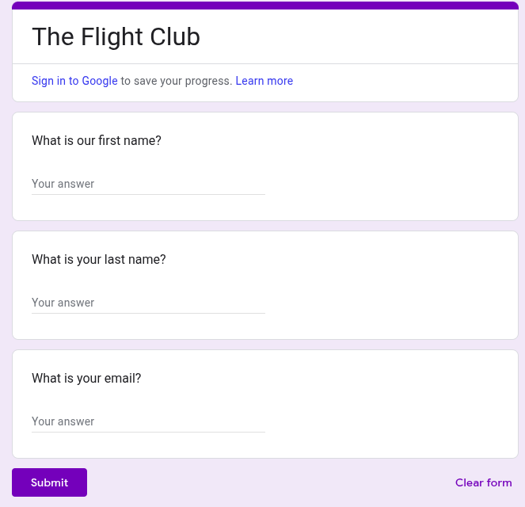
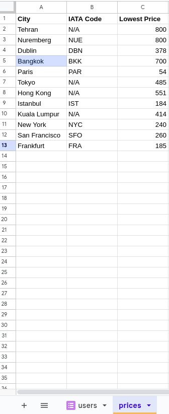
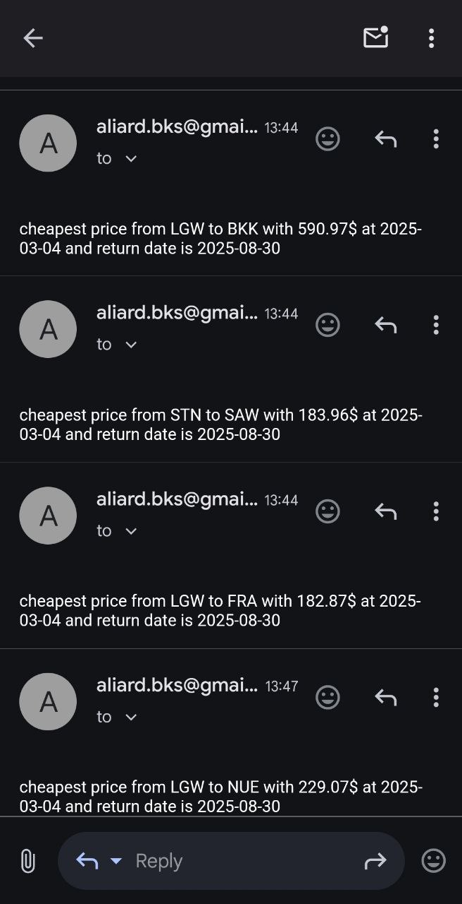

# ✈️ Flight Deal Finder

A Python project that tracks flight prices using the **Amadeus API** and sends email notifications when cheaper deals are found.

---

## 🚀 Project Overview
1. **User Registration**  
   - Users enter their details (First Name, Last Name, Email) via a **Google Form**.  
   - Data is stored in a **Google Sheet**.

2. **Fetching Airport Codes**  
    - Uses **Amadeus API (`flight-offers-search`)** to get flight details and set to a **Google Sheet**.
    - The system reads **IATA airport codes** from Google Sheets.  

3. **Data Storage and Processing**  
   - A `FlightData` model is created to store flight details.  
   - Direct flights are preferred, but **cheaper stopover flights** are also considered.

4. **Email Notifications**  
   - If a cheaper flight is found, an **email alert** is sent to registered users.

---

## 🖥️ How It Works
1. **User signs up via Google Form.**  
2. **System fetches flight prices from Amadeus API.**  
3. **Data is stored and analyzed.**  
4. **Cheapest deals are emailed to users.**  

---

## 📊 Technologies Used
- **Python** (Backend processing)
- [**Amadeus API**](https://developers.amadeus.com/self-service/apis-docs) (Flight search)
- [**Google Sheets API**](https://dashboard.sheety.co/) (Accessing and modifying Google Sheets)
- **SMTP** (Email notifications)
- **dotenv** (Environment variable management)

---

## 📷 Screenshots

| Google Form  | Flight Deals | Email Alert |
|-------------|-------------|-------------|
|  |  |  |