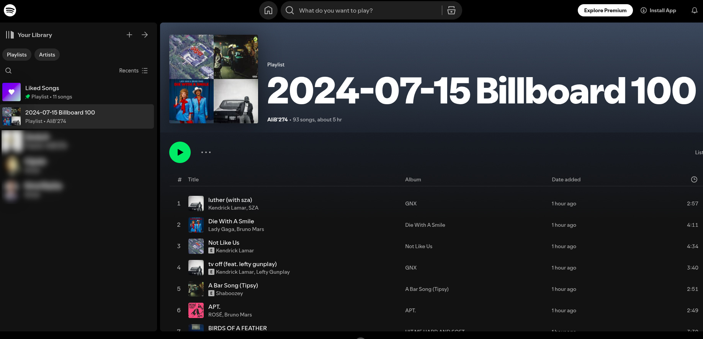

# **🎵 Spotify Playlist Creator**

A Python project that creates a playlist on **Spotify** based on the [**Billboard Hot 100**](https://www.billboard.com/charts/hot-100/) chart for a specific date. The app scrapes the Billboard chart and automatically adds available tracks to the created playlist on Spotify.

---

## 🚀 **Project Overview**

This project allows you to:

- **Scrape Billboard Hot 100** chart data for a specific date.
- **Authenticate with Spotify** and create a playlist.
- **Automatically add songs** from the chart to the playlist if they are available on Spotify.

---

## 🖥️ **How It Works**

1. **User Authentication with Spotify**  
   - The app authenticates users via **Spotify API** using the [**Spotipy**](https://spotipy.readthedocs.io/) library.  
   - A Spotify Developer account is required for authentication and interacting with the API.

2. **Scraping Billboard Data**  
   - The app scrapes data from **Billboard Hot 100** chart using [**BeautifulSoup**](https://www.crummy.com/software/BeautifulSoup/bs4/doc/).  
   - Scrapes the data for a specific date from:  
   `https://www.billboard.com/charts/hot-100/{date}`

3. **Creating Playlist**  
   - A playlist with the name **Billboard Hot 100 – {date}** is created on the authenticated Spotify account.

4. **Adding Songs to Playlist**  
   - The app checks each track in the Hot 100 chart and adds it to the playlist if it’s available on Spotify.  
   - Unavailable songs are skipped.

---

## 📊 **Technologies Used**

- **Spotipy** (Spotify API)
- **BeautifulSoup** (Web scraping)
- **Requests** (Fetching HTML data)

---

## 📷 **Screenshots**

**
*Example of the playlist created on Spotify*
